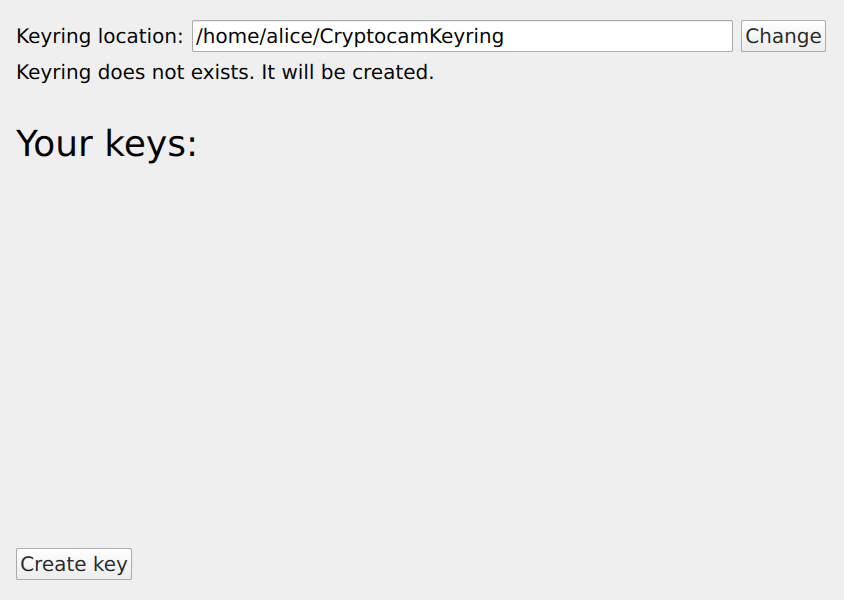
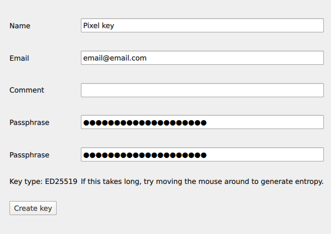
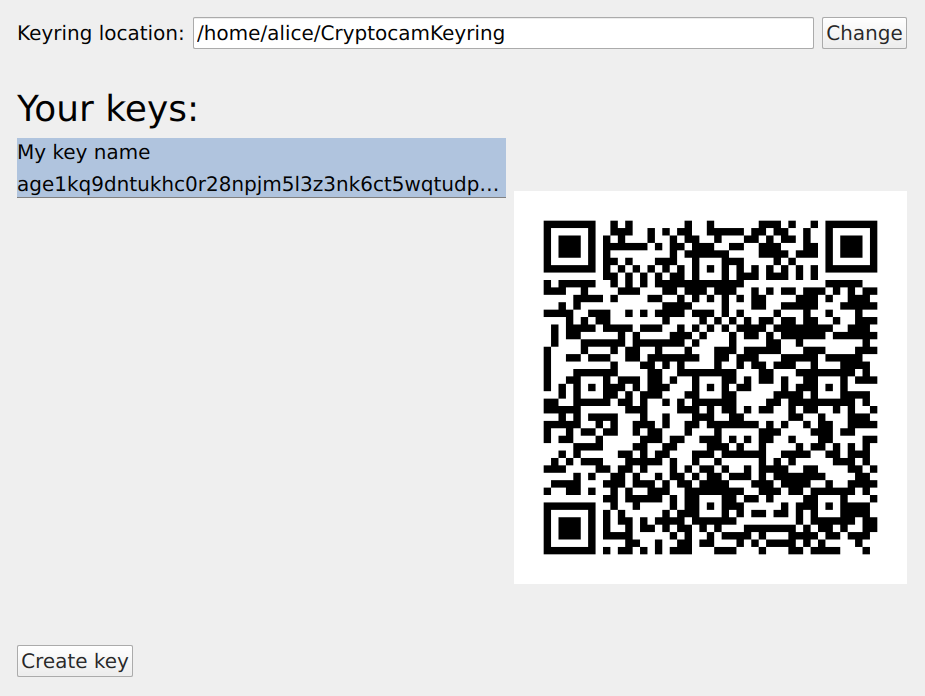
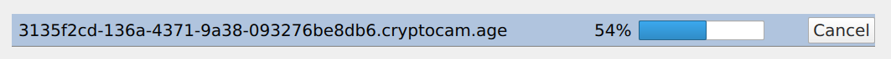

# Cryptocam Companion App

## [Full Cryptocam how-to here](https://cryptocam.gitlab.io/)

This tool is a Graphical interface to decrypt videos taken by [Cryptocam](https://gitlab.com/cryptocam/cryptocam) as well as managing keys.

This is designed to be usable for people who are not used to the CLI. For a command line
version, see
[cryptocam-companion-cli](https://gitlab.com/cryptocam/cryptocam-companion-cli)

# Downloading and running

Download the latest AppImage from the [Releases page](https://gitlab.com/cryptocam/cryptocam-companion/-/releases). It's a large file, but it includes all dependencies required to run it, so you can move it to an airgapped computer and run it without any setup.

To run the AppImage, you need to make it executable. In most file managers, this is done by right-clicking the file, opening "Properties" and either checking a box or selecting something like "Executable for owner/anyone". Alternatively, run `chmod +x /path/to/AppImage`.

Now just double click the AppImage file.

## Without AppImage

A regular executable download is also available. You'll need Qt5 with all QtQuick
libraries installed, as well as `libavcodec`, `libavformat`, `libavfilter`, `libswscale` and `libavutil`.

# Usage

## Generating a key

To list available keys, click "Manage keys". There will be no keys initially. If you want
to pick a specific location for your keyring (e.g. a flash drive), you can choose a folder
where keys will be saved.

Otherwise, create a new key. Enter a descriptive name, and most importantly a strong passphrase to encrypt the key itself. Then click `Create key`.

If you're worried about losing the key, consider making a backup of your keyring
directory, or any specific key files inside it. They are encrypted with the passphrase you
just entered and can be copied into your keyring directory to reimport them later.

To record videos with Cryptocam, you'll need to to import the public key you want to
encrypt with into the app. To do that, open the "Manage keys" window and select the key
you want to use. In Cryptocam, go to `Settings` > `Keys` and click the big button to scan
the QR code. You can change the name it's saved as in the app, and then import it.
Now you're ready to record.

## Decrypting videos

After transferring all files from your Android to the computer, you can open them in the
Companion app by dragging them onto the window, or by clicking `Open files`/`Open folder`.
Select an output location where the decrypted videos will be saved and click `Decrypt`.
You will be asked to enter the passphrases for the keys required to decrypt.

