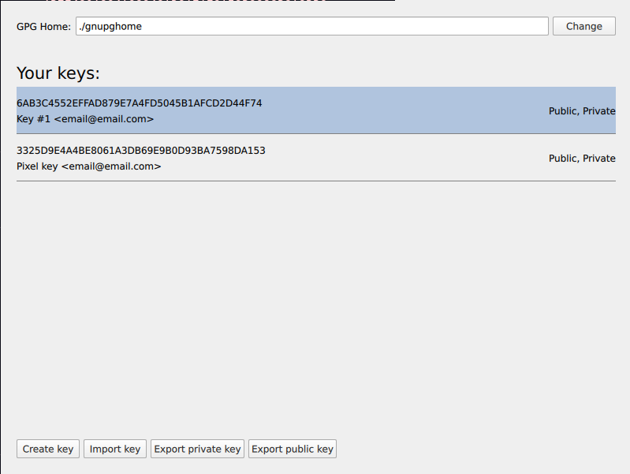

# Cryptocam Companion App

## [Full Cryptocam how-to here](https://cryptocam.gitlab.io/)

This tool is a Graphical interface to decrypt videos taken by [Cryptocam](https://gitlab.com/tnibler/cryptocam) as well as managing GPG keys without using the CLI.

This is designed to be usable for people who are not used to the CLI and have never used GPG before.

If you don't need a GUI, you can use something like [this shell script](https://gist.github.com/m-rey/3d64b393936fb64360052ee7ee8c61d6) to decrypt videos.

# Downloading and running

Download the latest AppImage from the [Releases page](https://gitlab.com/tnibler/cryptocam-companion/-/releases). It's a large file, but it includes all dependencies required to run it, so you can move it to an airgapped computer and run it without any setup.

To run the AppImage, you need to make it executable. In most file managers, this is done by right-clicking the file, opening "Properties" and either checking a box or selecting something like "Executable for owner/anyone". Alternatively, run `chmod +x /path/to/AppImage`.

Now just double click the AppImage file.

## Without AppImage

Dependencies: FFmpeg, Qt5, PyQt5, gpg.

Clone this repo via `git clone https://gitlab.com/tnibler/cryptocam-companion` and `cd cryptocam-companion`.

Install dependencies with `pipenv install`, and run `pipenv run python src/main.py`.

# Usage

## Setting up GPG

To list available keys, open `GPG Settings`. If you already have keys you want to use, you can import them here. 

Otherwise, create a new key. You can enter anything into the Name, Email and Comment fields or leave them blank (except the Email field which you should probably leave as it is). Enter a strong passphrase to encrypt the key itself and click `Create key`. 

If you're worried about losing the key, consider making a backup by exporting the private key and saving it in a safe location. After clicking `Export private key`, you'll have to enter the passphrase you just set up. The resulting `.priv` file is still encrypted with the same passphrase.

To record videos with Cryptocam, you'll need to export your public key the same way and transfer it to your Android device. On your phone, import it in OpenKeychain, and you're ready to record.

## Decrypting videos

After transferring all files from your Android to the computer, you can open them in the Companion app via `Open files` (select all `.mp4` and `.pgp` files) or open an entire Folder. Select an output location where the decrypted videos will be saved and click `Decrypt`. 

# Screenshots

