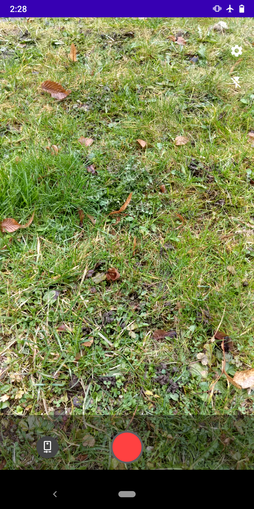
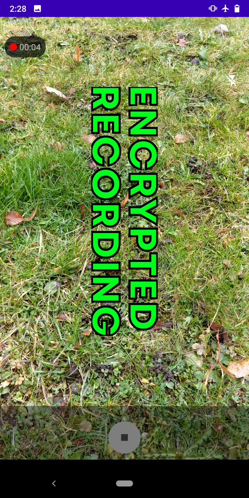
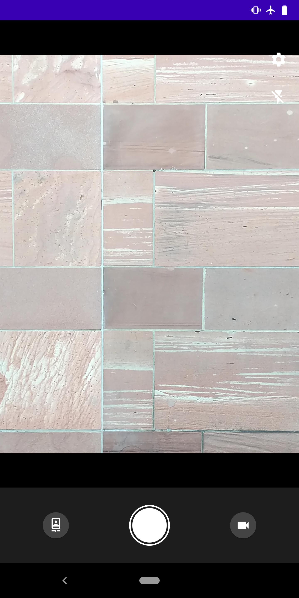

# Cryptocam: record encrypted video

Recording certain situations can be dangerous for the person using the camera as well as the people being recorded. To mitigate the risk of the recording device or storage medium getting into the hands of an attacker with an interest in the recordings, Cryptocam allows you to record video and audio that is encrypted on the fly and never persisted to disk in unencrypted form.

[](https://f-droid.org/packages/com.tnibler.cryptocam/)



<!-- replace with 2.0 screenshot  -->

## How it works

Cryptocam uses [age](https://github.com/FiloSottile/age) to encrypt video and audio with ChaCha20Poly1305 and X25519 as it's recorded.

Using `age` with only the public key(s) stored on the device means that recordings can not be decrypted on the phone by you or an attacker under any circumstances.

## How to use it

## [Full Cryptocam how-to here](https://cryptocam.gitlab.io/)

Setup:

- [Install Cryptocam from F-droid](https://f-droid.org/packages/com.tnibler.cryptocam/)
- Install either the [graphical companion tool](https://gitlab.com/cryptocam/cryptocam-companion) or the [cli version](https://gitlab.com/cryptocam/cryptocam-companion-cli)
- Using either tool, generate a key and scan the qr code in Cryptocam to import it
- Create a folder on your device and set it as the output location where recordings will be stored

Before using Cryptocam, please choose your desired camera settings (resolution and framerate) and test that they actually work.

Not all configurations are supported by all devices, so if you choose one that your device does not support, Cryptocam falls back to your devices preferred configurations. So unless you want to be surprised by 1200x1200 video at 15 fps, test before using it!

So far, these devices have been tested:

- Samsung Galaxy S9: up to 1920x1080 at 60fps. No 4K
- Google Pixel 2XL: up to 1920x1080 at 60fps. No 4K
- LG G6: up to 1920x1080 at 60fps. No 4K

Please share your results on your device as well!

## Decrypting videos

See either the [tutorial site](https://cryptocam.gitlab.io) for a detailed walkthrough or the README of the [cli](https://gitlab.com/cryptocam/cryptocam-companion-cli) or [graphical companion](https://gitlab.com/cryptocam/cryptocam-companion) tool you prefer to use.

## Building

Requirements: `go`.

```shell script
# install gomobile
go get golang.org/x/mobile/cmd/gomobile
cd path/to/cryptocam
mkdir app/libs
cd age-encryption
# either add $HOME/go/bin to your path or relace the gomobile with ~/go/bin/gomobile
gomobile init
export ANDROID_HOME=<path> # probably $HOME/Android/Sdk
export ANDROID_NDK_HOME=<path> # something like $HOME/Android/Sdk/ndk/23.0.7123448
gomobile bind -o ../app/libs/encrypted_writer.aar tnibler.com/cryptocam-age-encryption

cd ..
./gradlew assembleRelease
```

## Roadmap

Planned:

- [x] ~~extensive documentation and tutorials how to use this~~
- [x] ~~Graphical tool to decrypt videos on desktop~~
- In the app:
  - [x] ~~Ability to record in the background~~
  - [ ] Photo mode
- [ ] An Android app to manage keys and decrypt videos

## Contributing

Please test Cryptocam on your available devices and share the results. Create an issue or send me an email at cryptocam@tnibler.de to explain what is and what is not working.
